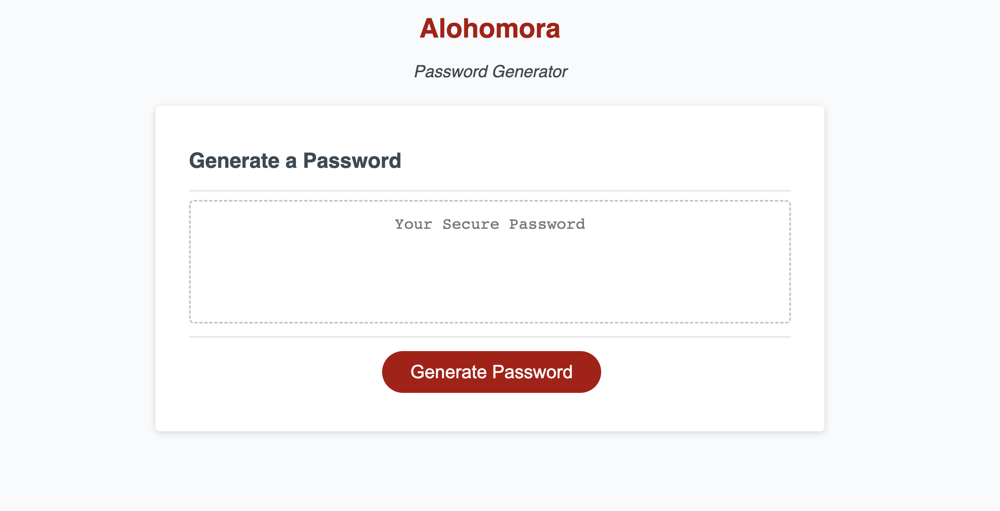

<h1 align="center"> Alohomora </h1>

<p align="center">
    
  <br>
  <i>Alohomora is a password generator
    <br> built using JavaScript.</i>
  <br>
</p>

<p align="center">
  <a href="https://larigens.github.io/alohomora/"><strong>Alohomora</strong></a>
  <br>
</p>


---
## Description

An application that enables users to generate random passwords based on the criteria that they’ve selected.

## Table of Contents
- [Description](#description)
- [Table of Contents](#table-of-contents)
- [Installation](#installation)
  - [Cloning the Repository](#cloning-the-repository)
  - [Prerequisites](#prerequisites)
  - [Setting Up](#setting-up)
- [Mock-Up](#mock-up)
- [Usage](#usage)
- [Guide](#guide)
- [Questions](#questions)
- [Contributions](#contributions)
  - [Contributing Guidelines](#contributing-guidelines)
  - [Code of Conduct](#code-of-conduct)
- [Credits](#credits)
  - [Acknowledgements](#acknowledgements)
  - [Links](#links)
- [License](#license)

## Installation

If you would like to understand more about the code behind the app and edit it:

### Cloning the Repository

Click `<> code` - the green button. After clicking, in the local tab, copy the SSH key. Open the terminal in your Macbook or [git bash](https://git-scm.com/downloads), if you have Windows/Linux, and type:

```bash
git clone [paste ssh key]
```

I would recommend downloading [Visual Studio Code](https://code.visualstudio.com/download) to edit the code locally. If you need more information on how to clone a repository, [click here](https://docs.github.com/en/repositories/creating-and-managing-repositories/cloning-a-repository)!
### Prerequisites

## Mock-Up

The following image shows the web application's appearance and functionality:



## Usage

First, the user needs to click on the red button to generate a password, and then a series of prompts will appear so that the desired type of criteria is selected.

1. Desired length of the password (From 8 to 128 characters),
2. If the user would like to include lowercase letters,
3. If the user would like to include uppercase letters,
4. If the user would like to include numeric characters,
5. If the user would like to include special characters.
   
> **The user MUST select at least one of the criteria, or an alert will be displayed.**

If the user enters a valid length and selects at least one of the criteria, the password is then generated and displayed within the textarea.

## Questions

For questions and support please <a href="mailto:larigens@gmail.com">email me</a>!

## Contributions

### Contributing Guidelines

Want to report a bug, contribute some code, request a new feature, or improve the documentation? You can submit an issue and I will gladly welcome you as a contributor, but before submitting an issue, please search the issue tracker, as it may already exist!

### Code of Conduct

Our Code of Conduct follows the same principles as the [Contributor Covenant](https://www.contributor-covenant.org/version/2/1/code_of_conduct/), version 2.1.

## Credits

### Acknowledgements

- [W3 Schools](https://www.w3schools.com)

- [MDN](https://developer.mozilla.org/en-US/)

- [FrontEnd Trend](https://linktr.ee/frontend_trend)

- [OWASP Foundation](https://www.owasp.org/index.php/Password_special_characters)
  
- [Rouvelle](https://www.rouvelle.com/javaScript_strings_to_numbers.htm)

### Links

[](https://larigens.github.io/lari-gui/)
[](https://www.linkedin.com/in/lari-gui/)
[](https://twitter.com/coffeebr_eak)

## License

Please refer to the [LICENSE](https://choosealicense.com/licenses/mit/) in the repo.
